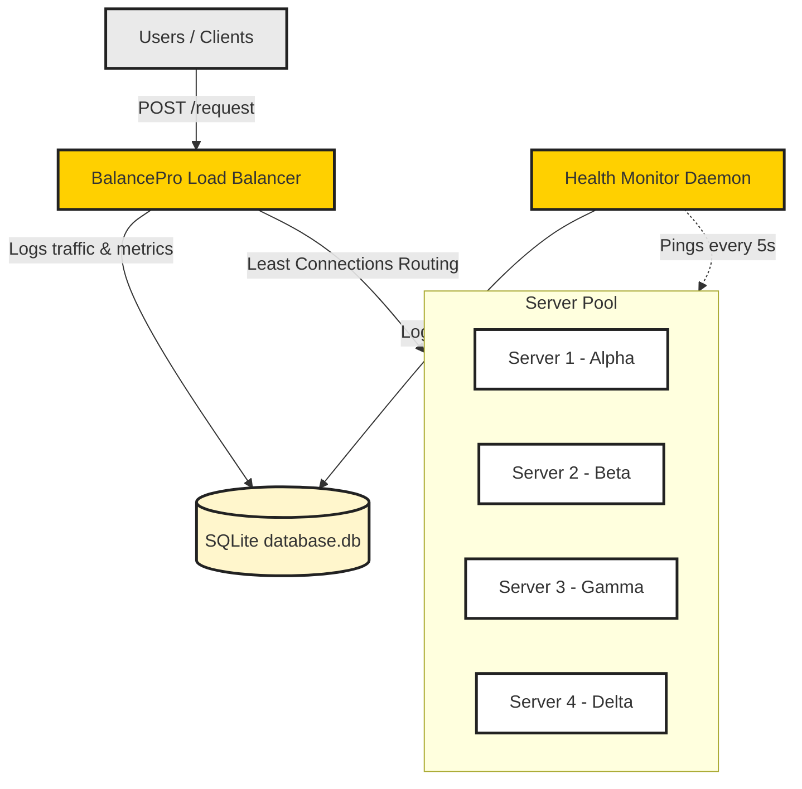

# System Architecture Diagrams

This folder is designed to store structural topology layouts. You can copy the Mermaid script below into [Mermaid Live Editor](https://mermaid.live/) to generate a high-definition image layout to save in this directory.

## Mermaid System Architecture Layout:

