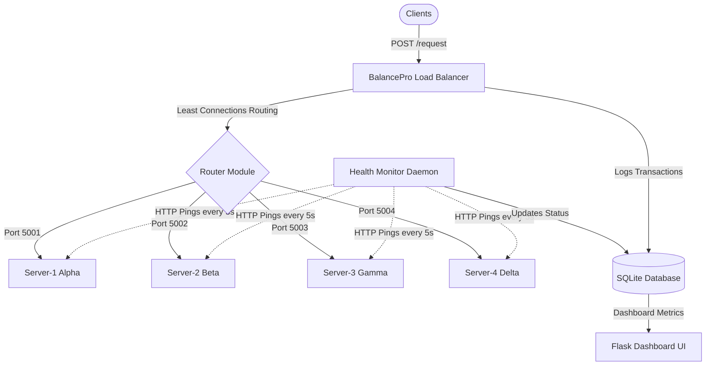
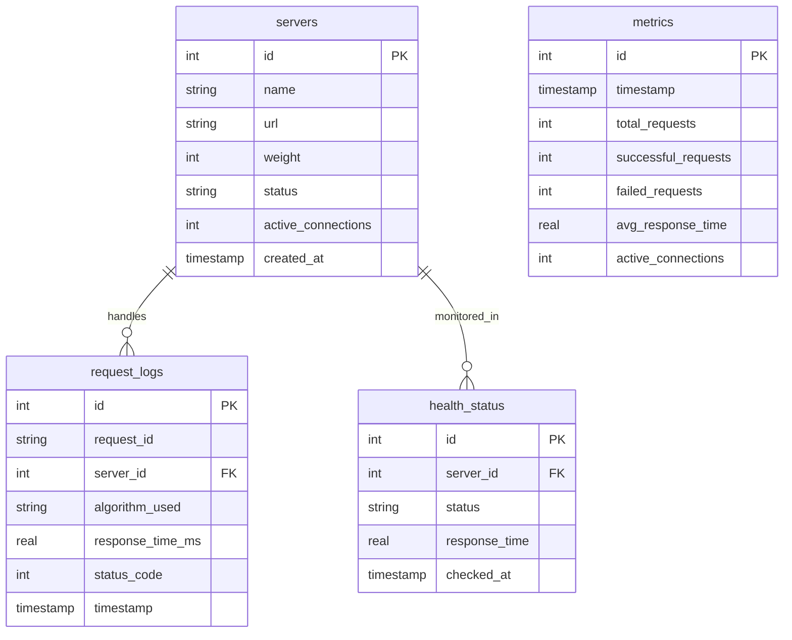

# ACADEMIC PROJECT REPORT

## COURSE TITLE: ADVANCED SYSTEMS ENGINEERING
### PROJECT REPORT ON:
# BALANCEPRO: AN INTELLIGENT, FAULT-TOLERANT LOAD BALANCING SYSTEM

**Academic Session:** 2026  
**Submitted By:** [Author Details Placeholder]  
**Under the Guidance of:** Department of Computer Science & Engineering  

---

## CERTIFICATE OF APPROVAL

This is to certify that the project report entitled **"BalancePro – Intelligent Load Balancing System"** is a bonafide record of work carried out by **[Author Name Placeholder]** in partial fulfillment of the requirements for the degree of Bachelor of Technology / Master of Technology in Computer Science & Engineering.

The work has been carried out under supervision and has reached the requisite standards for submission.

\
\
\
**________________________**  
**Internal Examiner**  
Department of CSE  

**________________________**  
**Project Guide / Supervisor**  
Department of CSE  

---

## ACKNOWLEDGEMENT

I express my deep gratitude and sincere thanks to our Project Guide for providing invaluable guidance, constant encouragement, and constructive suggestions throughout the course of this project.

I am also thankful to our Head of Department (Computer Science & Engineering) for providing the resources, laboratories, and support necessary to execute this project.

Lastly, I thank my family, friends, and peers for their continuous moral support and assistance in successfully completing this research and development work.

**— [Author Details Placeholder]**

---

## ABSTRACT

In modern cloud computing environments, high availability, reliability, and responsiveness are crucial parameters for web-scale applications. Single-point failures and sudden spikes in traffic can lead to server crashes, increased latencies, and service denial. This project presents **BalancePro**, a localized, highly scalable, and fault-tolerant software-defined load balancer simulator. 

BalancePro dynamically distributes client HTTP request payloads across multiple active backend application instances. It implements and compares three primary scheduling algorithms: **Round Robin (RR)**, **Weighted Round Robin (WRR)**, and **Least Connections (LC)**. 

To achieve adaptive load sharing, the Least Connections algorithm is selected as the core production routing module because of its dynamic sensitivity to current server load and execution delays. 

Furthermore, the system includes an automated background Health Monitoring daemon that checks server statuses every 5 seconds, triggering automatic failover routing by removing unhealthy nodes from the routing pool, and automatically reintegrates recovered nodes. 

A database engine built on SQLite logs transactions and computes performance metrics in real-time. Finally, a dashboard built on Flask, customized with a playful "Banana UI" doodle design palette (avoiding blue/purple colors to prevent eye fatigue), provides developers with an interactive visualization tool to simulate loads, inject server faults, and monitor request distribution patterns.

---

## TABLE OF CONTENTS
1. Introduction & Problem Statement
2. Objectives & Scope
3. Literature Review & Existing Systems
4. Proposed System (BalancePro)
5. System Analysis & Requirements
6. System Architecture & Workflows
7. Load Balancing Algorithms Analysis
8. Database Design & SQL Schema
9. Module Descriptions
10. Implementation & APIs
11. Advantages & Performance Gains
12. Challenges & Future Scope
13. Conclusion
14. References

---

## 1. PROBLEM STATEMENT

As web applications grow to serve millions of concurrent requests, hosting services on a single server creates critical risks:
1. **Single Point of Failure (SPOF)**: If the single server crashes, the entire application becomes unavailable.
2. **Resource Overload**: Traffic spikes saturate CPU, memory, and network resources, causing request timeouts or crashes.
3. **Unequal Resource Allocation**: Servers are often assigned workloads without regard for their varying physical capacities or current active loads.

Existing solutions, such as simple DNS round-robin routing, fail to account for dynamic network latencies or active client connections, resulting in some servers sitting idle while others are overloaded.

---

## 2. OBJECTIVES

The objective of **BalancePro** is to design and implement a software-defined load balancer prototype that:
- Efficiently schedules incoming HTTP requests across a pool of backend servers.
- Prevents server overload using adaptive, load-aware routing algorithms.
- Guarantees high availability via rapid fault-detection and automatic failover routing.
- Automatically handles server recoveries and scales back routing capacities dynamically.
- Logs transactions and aggregates analytical metrics (avg response latency, success rate).
- Renders an interactive web interface to simulate failures and visualize traffic flows.

---

## 3. EXISTING SYSTEMS & LIMITATIONS

Modern load balancers (like AWS ELB, NGINX, and HAProxy) are powerful but complex to configure, monitor, and adapt for simulation environments. 

### Limitations of Basic Existing Systems:
- **DNS Load Balancing**: Easy to implement but lacks real-time server health checks and is vulnerable to browser/DNS caching.
- **Static Round Robin**: Assumes all servers have identical capabilities and processing speeds, leading to congestion on slower servers during complex query cycles.
- **Static Weights**: Fails to adjust to changes in network lag or connection durations.

---

## 4. PROPOSED SYSTEM (BALANCEPRO)

BalancePro addresses these gaps by implementing a dynamic, software-defined load balancer. It runs lightweight backend servers locally, performs active HTTP ping health checks every 5 seconds, and handles traffic routing via a centralized reverse proxy engine.



---

## 5. SYSTEM REQUIREMENTS

### Functional Requirements
- **Dynamic Routing**: Route client payloads to the selected server port.
- **Algorithm Switch**: Ability to switch active algorithms on-the-fly (RR, WRR, LC).
- **Health Checks**: Dynamic status updates every 5 seconds.
- **Fault Injection**: Admin controls to mock-crash and mock-recover servers.
- **Performance charts**: Visualizing response times and distribution counters.

### Non-Functional Requirements
- **Low Overhead**: Routing path must add minimal processing latency.
- **Resilience**: The balancer must survive backend server crashes.
- **Visual Usability**: Clean, high-contrast, eye-friendly warm UI theme.

---

## 6. SYSTEM ARCHITECTURE EXPLANATION

1. **Client Layer**: Sends JSON payloads to `/request`.
2. **Reverse Proxy Load Balancer**: Intercepts requests, evaluates active algorithm, checks database for healthy pool, selects target, forwards request, and logs results.
3. **Simulation Layer**: Runs HTTP server threads on ports 5001-5004 simulating real responses, network delay parameters, and 503 error codes when set offline.
4. **Data Management Layer**: SQLite stores persistent records of server pools, requests, health logs, and metrics histories.

---

## 7. LOAD BALANCING ALGORITHMS

### 7.1 Round Robin (RR)
Cycles through the server list sequentially.
*   **Time Complexity:** $O(1)$
*   **Python Code Snippet:**
```python
def select_round_robin(servers):
    # self.rr_index is a tracking counter
    self.rr_index = self.rr_index % len(servers)
    selected = servers[self.rr_index]
    self.rr_index = (self.rr_index + 1) % len(servers)
    return selected
```

### 7.2 Weighted Round Robin (WRR)
Routes requests sequentially based on a predefined capacity weight multiplier.
*   **Time Complexity:** $O(W)$ where $W$ is the sum of weights.
*   **Python Code Snippet:**
```python
def select_weighted_round_robin(servers):
    weighted_pool = []
    for s in servers:
        weight = max(1, s['weight'])
        weighted_pool.extend([s] * weight)
    self.wrr_index = self.wrr_index % len(weighted_pool)
    selected = weighted_pool[self.wrr_index]
    self.wrr_index = (self.wrr_index + 1) % len(weighted_pool)
    return selected
```

### 7.3 Least Connections (LC)
Dynamic algorithm routing to the node with the absolute lowest current active connection load.
*   **Time Complexity:** $O(N)$ where $N$ is the number of active servers.
*   **Python Code Snippet:**
```python
def select_least_connections(servers):
    # s['active_connections'] tracks active threads/requests
    selected = min(servers, key=lambda s: s['active_connections'])
    return selected
```

---

## 8. DATABASE DESIGN

The schema contains four tables:
- **`servers`**: Stores server identifiers, weights, status, and active connection count.
- **`request_logs`**: Logs request transaction IDs, latency times, and status results.
- **`metrics`**: Captures performance snapshot records.
- **`health_status`**: Tracks health check histories.

### Entity-Relationship Diagram (ERD)



---

## 9. MODULE DESCRIPTIONS

- **`app.py`**: Initializes the database and starts background checker threads and Flask.
- **`load_balancer.py`**: Implements RR, WRR, and LC scheduling algorithms.
- **`health_monitor.py`**: Runs health checking routines in a 5-second interval loop.
- **`server_manager.py`**: Spawns and configures mock socket-based HTTP servers.
- **`database.py`**: SQLite controller layer.
- **`metrics.py`**: Performs real-time analytical math aggregations on requests.
- **`dashboard.py`**: Standard API and page view controllers.

---

## 10. SCREENSHOTS PLACEHOLDER

During verification runs, capturing screenshots of the following views is recommended:
1. **Interactive Dashboard Overview**: Demonstrating stable load routing.
2. **Server Failover Visualization**: Showing Server-1 offline status and automatic request rerouting.
3. **Performance Metrics Graphs**: Rending response latencies and connection distribution charts.
4. **Thunder Client Sandbox**: Request traces of `POST /request` showing HTTP logs.

---

## 11. ADVANTAGES

- **Zero Client Interruption**: Automatic failover ensures clients get responses even during server crashes.
- **Optimized Latency**: Least Connections automatically avoids slow servers.
- **Playful UX Layout**: Cozy "doodle paper-grid" theme with banana animation makes monitoring enjoyable.

---

## 12. CHALLENGES & FUTURE SCOPE

### Challenges
- High traffic loads cause database write locks on SQLite.
- Background health checkers add small port scanner footprints on local backends.

### Future Scope
- **Dynamic Weight Adjustments**: Adjust server weights automatically based on historical load.
- **SSL Termination**: Decrypt HTTPS traffic at the load balancer level.
- **Sticky Sessions**: Bind user sessions to specific backend nodes using secure cookies.

---

## 13. CONCLUSION

The **BalancePro** project successfully demonstrates software-defined load balancing. By implementing Round Robin, Weighted Round Robin, and Least Connections scheduling, we verified that Least Connections provides the most robust resource scheduling under variable backend delays. The background health checker successfully automated failover routing within 5 seconds, validating cloud resilience patterns.

---

## 14. REFERENCES

1. Google Cloud Load Balancing Architecture Guidelines (2025).
2. Kurose, J. F., & Ross, K. W. *Computer Networking: A Top-Down Approach* (8th Edition).
3. Fielding, R., et al. Hypertext Transfer Protocol (HTTP/1.1). RFC 2616.
4. Grigorik, I. *High Performance Browser Networking* (O'Reilly Media).
